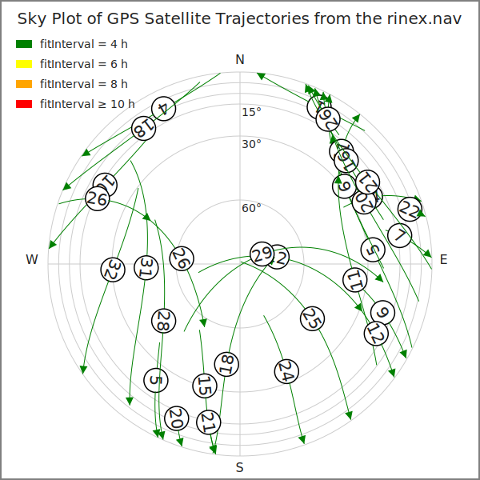
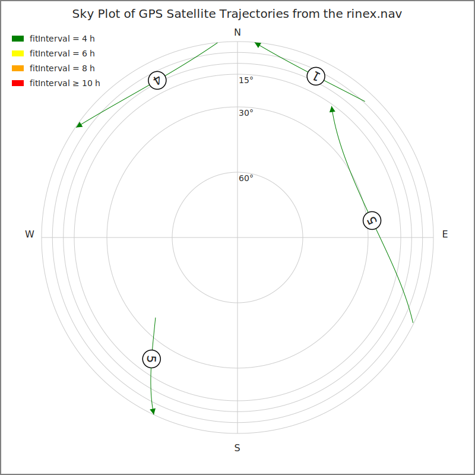

```
2025-12-22

EN:
======================================================================
SKY PLOT OF GPS SATELLITE TRAJECTORIES FROM RINEX 3.04 NAVIGATION FILE
======================================================================

This program generates a sky plot of computed GPS satellite
trajectories using data from a RINEX 3.04 navigation file. A sky plot
is a polar diagram showing satellite azimuth (0–360° angle from north
to side) and elevation (0–90° angle from the horizon upwards) relative
to the observer’s position. Each trajectory is drawn as a sequence of
time intervals, with PRN markers, direction arrows, and colors based
on the fitInterval field from the RINEX file.

Due to the large number of satellites or a long time span in the
navigation file, the resulting sky plot may become cluttered. In such
cases, the prnFilter parameter can be used to plot only the
trajectories of selected satellites.

This project was developed with assistance from Microsoft Copilot.

Input (to modify directly in the source code)
-----
  - observer position WGS84 coordinates
  - RINEX navigation file name
  - filter by satellite PRN
  - plot title

Output
------
  - sky plot SVG file skyplot.svg
```


```
PL:
======================================================================
               WYKRES NIEBA Z TRAJEKTORIAMI SATELITÓW GPS
                   Z PLIKU NAWIGACYJNEGO RINEX 3.04
======================================================================

Ten program generuje wykres nieba (sky plot) obliczonych trajektorii
satelitów GPS, korzystając z danych z pliku nawigacyjnego RINEX
3.04. Wykres nieba to diagram biegunowy przedstawiający azymut
satelity (0–360° kąt od kierunku północnego w bok) oraz elewację
(0–90° kąt od horyzontu w górę) względem pozycji obserwatora. Każda
trajektoria satelity jest rysowana jako sekwencja przedziałów
czasowych, z oznaczeniem PRN, strzałką kierunku oraz kolorami
wynikającymi z pola fitInterval w pliku RINEX.

Ze względu na dużą liczbę satelitów lub długi zakres czasowy pliku
nawigacyjnego, wynikowy wykres może stać się nieczytelny. W takich
przypadkach parametr prnFilter może zostać użyty do narysowania
jedynie trajektorii wybranych satelitów.

Projekt powstał przy wsparciu Microsoft Copilot.

Wejście (do zmodyfikowania bezpośrednio w kodzie programu)
-------
  - współrzędne WGS84 pozycji obserwatora
  - nazwa pliku nawigacyjnego rinex
  - filtr wg PRN satelity
  - tytuł wykresu

Wyjście
-------
  - wykres nieba w pliku SVG skyplot.svg
```
